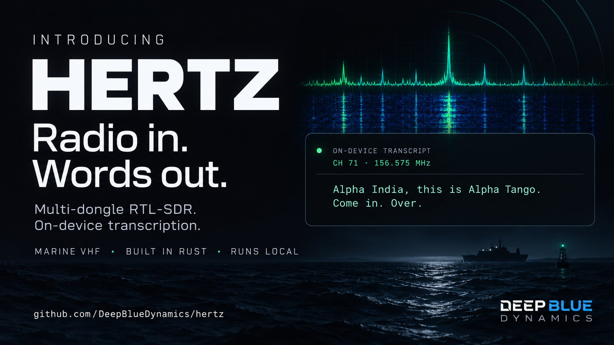

# hertz



A multi-dongle RTL-SDR radio receiver in Rust, tuned for marine VHF. `hertzd` owns
the dongles, demodulates NFM/AM, runs a squelch, records each transmission to WAV,
transcribes it on-device with [Cactus Whistle](../forest/whistle), and serves
everything over REST, WebSocket and SSE. `hertz` is the terminal client.

## Quick start (Windows, native)

One RTL-SDR on a WinUSB driver (see [docs/INSTALL.md](docs/INSTALL.md)). Copy
`hertz.windows.example.toml` to `data\hertz.windows.toml`, set your dongle serial, then:

```powershell
cargo build --release -p hertz-daemon
.\target\release\hertzd.exe data\hertz.windows.toml --listen
```

`--listen` plays squelch-gated audio on the default output device and prints one
console line per squelch open/close and per transcript:

```
INFO scanning 4 channel(s): 68,69,71,72
INFO SQUELCH OPEN   | Ch 71 | 156.575 MHz | Signal: 1.6dB |
INFO SQUELCH CLOSED | Ch 71 | 156.575 MHz | Signal: -23.7dB | VOICE
INFO transcribed transmission_20261004_233946_Ch71_NON-COMM_156.575MHz_1 in 0.1s: Alpha India, this is Alpha Tango, come in, over.
```

Without `--listen` the daemon runs headless; connect a client with
`cargo run --release -p hertz-tui -- --connect http://127.0.0.1:9080`.

## Configuration

`hertzd [config.toml] [--listen] [--mock]` (or `HERTZ_CONFIG`). A working native
config:

```toml
[daemon]
listen = "127.0.0.1:9080"
data_dir = "./data"

[[dongle]]
serial = "00000001"
role = "monitor"              # one channel at 240 kS/s (or a scan list, below)
bandplan = "marine-vhf-us"
frequency_hz = 156625000      # fixed frequency when not scanning
scan = ["68", "69", "71", "72"]
squelch_db = 6.0              # open at noise floor + 6 dB
record = true

[transcription]
engine = "whistle"            # or omit the section to disable
language = "en"               # "auto" detects (en, de, fr, es, it, nl, pl)
keywords = ["Alpha India", "Alpha Tango", "come in", "over"]
```

Dongle roles:

| Role | What it does |
|---|---|
| `monitor` | Tunes one frequency directly at 240 kS/s. With `scan`, hops the listed channel ids, locks on any channel whose squelch opens, stays 5 s after it closes for replies, then resumes (about 1 s per sweep of 4 channels). |
| `channelized` | One 2.4 MS/s capture covering the bandplan; channels with activity are extracted and demodulated in parallel. `tap_channel` is always demodulated. |
| `hopscan` | Accepted by the config but not implemented yet; the dongle is skipped. |

Bandplans (`bandplans/*.toml`, 419 channels across marine, NOAA WX, FRS/GMRS, MURS,
ham 2 m/70 cm, CB, airband, railroad and public-safety interop) load from
`HERTZ_BANDPLANS`, `./bandplans`, `../bandplans` or `/etc/hertz/bandplans`.

## How a transmission is handled

1. **Squelch.** A frame opens the squelch when in-channel power clears the noise
   floor plus `squelch_db`, or when the demodulated audio looks like voice
   (spectral flatness). The floor is measured for the first second, adapts only
   while the squelch is closed, and is rate-limited downward, so the dip after a
   key-up can't latch it open.
2. **Audio.** NFM is demodulated with an 81-tap channel filter and AFC, then
   de-emphasized (750 µs), low-passed at 3 kHz and played at a fixed gain with a
   soft limiter. Only frames with signal present are played; the speaker keeps a
   300 ms jitter cushion and reopens the output if the device disappears.
3. **Recording.** Each transmission is written to
   `data/recordings/transmission_<utc>_Ch<id>_<label>_<freq>MHz_<n>.wav`
   (48 kHz mono 16-bit).
4. **Transcription.** Whistle transcribes the WAV off the recording path and writes
   `data/transcriptions/<same name>.txt`. Silence and static come back empty and
   are written as `(no speech detected)`. Recordings without a transcript are
   picked up at startup.

## Transcription (Cactus Whistle)

Whistle is a 16.9 MB on-device recognizer for 7 languages, used through the
`whistle` crate in `../forest/whistle`. On first use it downloads the engine
library and weights to `%LOCALAPPDATA%\whistle` (`~/.cache/whistle` on Unix):

```
whistle.cact               16.9 MB   speech model
3.1.0/libneedle3.dll        1.5 MB   needle engine
```

Override with `WHISTLE_WEIGHTS`, `WHISTLE_LIB_PATH` or `WHISTLE_CACHE`. On CPU a
3 s transmission transcribes in about 70 ms. `keywords` biases recognition toward
call signs and vessel names.

## Hyperia and ollaya (`hertz-relay`)

`hertz-relay` connects hertz to the Hyperia terminal and the ollaya decision
model, the groundwork for routing radio calls to agent panes:

```powershell
cargo run --release -p hertz-relay --bin hertz-panes
```

It reads the window/tab/pane layout from Hyperia (`HYPERIA_MCP_URL`,
`HYPERIA_AGENT_TOKEN`, both set in every Hyperia pane), sends it to ollaya
(`OLLAYA_URL`, default `http://127.0.0.1:11435`, model `laya:en`) and asks which
tab and pane are active, printing ollaya's answer next to Hyperia's own.

Setting up ollaya (container, model pulls, the `/api/decide` format):
[docs/OLLAYA.md](docs/OLLAYA.md).

## Workspace

| Crate | Purpose |
|---|---|
| `hertz-types` | Config, events, wire format |
| `hertz-channels` | Bandplan loader and channel database |
| `hertz-sdr` | RTL-SDR access (pure-Rust `rtl-sdr-rs`, vendored libusb), worker thread, reconnect |
| `hertz-dsp` | Channelizer, NFM/AM demod, squelch pipeline, listening chain, recorder |
| `hertz-daemon` | `hertzd`: runtime, scanner, REST/WS/SSE server, recorder, speaker, transcription |
| `hertz-tui` | `hertz`: TUI and CLI (`status`, `doctor`, `records`, `tail`, `tune`) |
| `hertz-relay` | Hyperia layout and ollaya clients, `hertz-panes` |
| `hertz-tx` | Placeholder for transmit support |

```powershell
cargo test --workspace
cargo clippy --workspace --all-targets
cargo fmt --all
```

Diagnostics: `cargo run --release -p hertz-sdr --example dump_fft` prints a live
spectrum, and `--example probe_levels` compares raw IQ levels across gain and
bandwidth settings.

## Known limitations

- **Whistle checkout.** `hertz-daemon` depends on `whistle` by path
  (`../forest/whistle`), so building needs that checkout next to this repo until
  whistle is vendored or published.
- **Gain.** The pure-Rust driver's manual gain pins the tuner VGA at 16.3 dB,
  about 10 dB below librtlsdr's, so dongles run on tuner AGC.
- **Hopscan** is not implemented, and the TUI's band scope does not render the
  monitor role's spectrum correctly yet.

More: [docs/INSTALL.md](docs/INSTALL.md) (drivers per OS, Whistle),
[docs/OPERATIONS.md](docs/OPERATIONS.md) (data, bandplans, diagnostics),
[docs/OLLAYA.md](docs/OLLAYA.md) (ollaya setup), and the frontend plans in
[plan/](plan/) (TUI waterfall spec and client brief).
